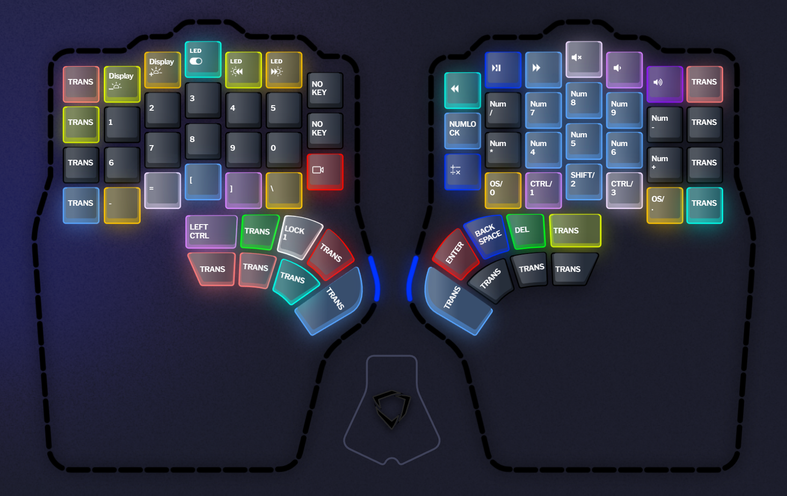

# Lower row mod profile

This profile is a [colemak-dh] layout with a `GASCG` lower-row-mod.

I'm using this lower-row-mod instead of home-row-mod because currently the dual-function keys and superkeys are too easy to misfire with the current firmware.

While putting the modifier keys to the lower row is not as convenient and comfortable compare to the home row,
it also has several advantages:

- The keys in the lower row are less frequently used, thus the chance of accidentally triggering the mod are lower.
- The keys in the lower row are less likely to be used consecutively (unlike, for example, `-ion` in the home row), also reducing the chance of accidentally triggering the mod.
- The keys in the lower row requires moving the fingers away from the home row, thus the keystroke tends to be shorter and also make it less likely to trigger the mod.
- Compare to the top row (it's really the second row on Defy, but you get my point), holding the mod and pressing the keys on the top row using the same hand is easier than holding the mod on the top row and pressing the keys on the lower row. This make it easier to manage with a single hand while using the mouse.

The `GASCG` mod configuration is experimental.
I use both a Mac and Windows (and Linux with WSL).
The extra `G` in index finger position may work better with Mac,
for example when taking screenshots to clipboard (`cmd+ctrl+shift+4`),
or when performing undo (`cmd+z`).

As for `GASC` vs `GACS`,
one extra benefits I have found with [colemak-dh] layout is that I can do `ctrl+s` and `ctrl+c` only with my left hand.
For `ctrl+d` with only left hand, I can do that with the thumb key `L15`.

## Layer 1 - colemak-dh

This is the base layer of the profile.

It is a [colemak-dh] layout with a `GASCG` bottom-row-mod.

The bottom-row-mod is implemented using dual-function keys.
Optimally I want to implement them as [RM superkeys][rm-superkey],
but currently (as of firmware 1.2.5-beta) there are some limitation preventing that from working.

### Layer 1 Main Area

The first row (`ESC-1...5` and `6...0-BACKSPACE`) are for convenience and familiarity.

The `TAB` in the second row is also for familiarity, but it is seldom used.
It might be removed or reassigned in the future.

The `BACKTICK`, `\`, and `'` are symbols close to their original positions,
and are used frequently in programming.
The `BACKTICK` is moved to the home row as it is frequently used in JavaScript, TypeScript, and Markdown.

The `OSM LEFT SHIFT` is mostly used as a regular `SHIFT` and a `CAPS LOCK`,
when I need to type several caps in a row.

(yes, double tapping it locks the `SHIFT`, making it behaves similar to a `CAPS LOCK`)

The `ENTER` key in the forth row is also for convenience,
and it is seldom used.

The `LOCK 10` is a qwerty layout for other language inputs,
and `LOCK 5` is a tap layout without mods.

### Layer 1 Left Thumb Cluster

| Left |     |     |     | Right |
| ---- | --- | --- | --- | ----- |
| L15  | L14 | L13 | L12 | L1    |
| L25  | L24 | L23 |     | L1    |

- L1: `SPACE` key without mod for typing spaces quickly.
- L12: [RSL superkey][rsl-superkey] - `TAB` + [Layer 4: Function](#layer-4---functions)
- L13: [RSL superkey][rsl-superkey] - `SPACE` + [Layer 2: Numbers](#layer-2---numbers)
- L14: Dual-function - `ESC` + [Layer 3: Symbol, Navigation, and Mouse](#layer-3---symbol-navigation-mouse)
- L15: `ctrl` for single-hand activation of shortcuts such as `ctrl+d`.
- L23-L25: They are assigned to `ENTER`, `DEL`, and `BACKSPACE` for single-hand use.

### Layer 1 Right Thumb Cluster

| Left |     |     |     | Right |
| ---- | --- | --- | --- | ----- |
| R1   | R12 | R13 | R14 | R15   |
| R1   |     | R23 | R24 | R25   |

- R1: `SPACE` key without mod for typing spaces quickly.
- R12: [RS superkey][rs-superkey] - `ENTER` + [Layer 4: Function](#layer-4---functions)
- R13: [RS superkey][rs-superkey] - `BACKSPACE` + [Layer 2: Numbers](#layer-2---numbers)
- R14: [RS superkey][rs-superkey] - `DEL` + [Layer 3: Symbol, Navigation, and Mouse](#layer-3---symbol-navigation-mouse)
- R15: `TAB` but seldom used.

## Layer 2 - Numbers

This is the numbers layer but can also act as navigation layer with the num pad and num lock.
The bottom row has the same `GASCG` mod.

### Layer 2 Main Area

First row inherit the `ESC` and `BACKSPACE` keys from [Layer 1](#layer-1---colemak-dh).
And the media keys are copied to [Layer 4](#layer-4---functions).
They remain here for the time being and can be replaced with macro keys.

Left side captures the number rows as well as the remaining symbol keys.

Right side captures the num pad, with the `NUM LOCK` to enable navigation.
Note that the `0` and `.` key are the regular non num pad keys,
to avoid activating `INSERT` and `DEL`.

### Layer 2 Left Thumb Cluster

| Left |     |     |     | Right |
| ---- | --- | --- | --- | ----- |
| L15  | L14 | L13 | L12 | L1    |
| L25  | L24 | L23 |     | L1    |

The Layer 2 left thumb cluster is essentially the same as Layer 1,
except `L13` locks the layer back to [Layer 1](#layer-1---colemak-dh).

### Layer 2 Right Thumb Cluster

| Left |     |     |     | Right |
| ---- | --- | --- | --- | ----- |
| R1   | R12 | R13 | R14 | R15   |
| R1   |     | R23 | R24 | R25   |

The Layer 2 right thumb cluster is similar to Layer 1,
but `R12-R14` are not superkeys.

This allows me to repeat those keys without the delays of the superkeys by holding `L13` to shift to this layer.

## Layer 3 - Symbol, Navigation, Mouse

This is the layer for symbols, navigation, and mouse.

Left side captures the symbols in the same orientation mirroring [Layer 2](#layer-2---numbers).

Right side captures the navigation and mouse keys.

## Layer 4 - functions

[colemak-dh]: https://colemakmods.github.io/mod-dh/
[rm-superkey]: ../../superkeys/readme.md#rm-superkey
[rs-superkey]: ../../superkeys/readme.md#rs-superkey
[rsl-superkey]: ../../superkeys/readme.md#rsl-superkey
