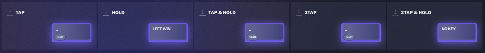
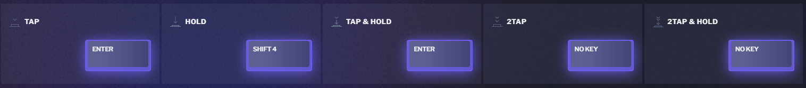
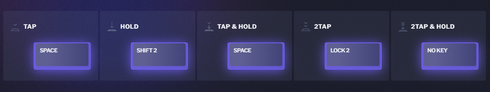

# Superkeys

The [profiles](../profiles/readme.md) utilize some [superkeys].

They typically follow certain forms, and you can learn more about them here.

## RM superkey

RM stands for Repeatable Modifier.

This superkey allows you to `hold` the key to activate a modifier such as `[shift]` or `[ctrl]`,
while repeat the `tap` key by doing `tap & hold`.

## RS superkey

RS stands for Repeatable layer Shift.

This superkey can be press and repeated similar to regular keys,
while supporting shift to a layer.

## RSL superkey

RSL stands for Repeatable layer Shift Lock.

This superkey can be press and repeated similar to regular keys,
while supporting shift and lock to a layer.

[superkeys]: https://dygma.com/blogs/product-development/new-bazecor-software
